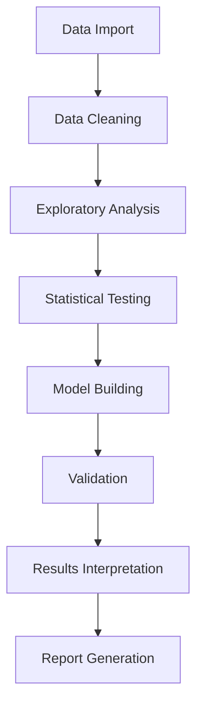

# 🏥 Healthcare Cost Analysis using R

<div align="center">


</div>

---

## 📊 Project Overview

A **comprehensive statistical analysis** of hospital costs conducted for the US Agency for Healthcare, focusing on inpatient samples from Wisconsin for patients aged 0-17 years. This project employs advanced R programming and statistical techniques to analyze healthcare costs, utilization patterns, and resource allocation strategies.

> 🎯 **Objective**: Analyze hospital discharge costs, patient demographics, and treatment patterns to optimize healthcare resource allocation and ensure equitable care delivery

---

## 🔬 Research Questions & Analysis

### **📈 Primary Research Objectives**

1. **👥 Patient Demographics Analysis**
   - Identify age categories with highest hospital frequency and expenditure
   - Analyze spending patterns across different age groups

2. **🏥 Diagnosis-Related Group (DRG) Analysis**
   - Determine DRGs with maximum hospitalization rates
   - Identify most expensive treatment categories
   - Analyze severity-cost relationships

3. **⚖️ Healthcare Equity Assessment**
   - Investigate relationship between patient race and hospitalization costs
   - Ensure no discriminatory pricing practices
   - Analyze cost disparities across racial groups

4. **💰 Resource Allocation Optimization**
   - Examine cost severity by age and gender
   - Develop resource allocation strategies
   - Identify high-cost patient segments

5. **📅 Length of Stay Prediction**
   - Predict hospital stay duration using demographic factors
   - Build predictive models with age, gender, and race variables
   - Optimize bed utilization and capacity planning

6. **🔍 Comprehensive Cost Factor Analysis**
   - Identify primary variables affecting hospital costs
   - Multiple linear regression modeling
   - Variable importance and interaction analysis

---

## 🗂️ Dataset Description

### **📋 Data Characteristics**
- **Source**: US Agency for Healthcare nationwide survey
- **Geographic Scope**: Wisconsin state hospitals
- **Population**: Pediatric and adolescent patients (0-17 years)
- **Data Type**: Inpatient discharge records

### **📊 Variable Definitions**

| **Variable** | **Type** | **Description** |
|-------------|----------|----------------|
| `Age` | Continuous | Age of patient at discharge (0-17 years) |
| `Female` | Binary | Gender indicator (1 = Female, 0 = Male) |
| `Los` | Continuous | Length of stay in hospital (days) |
| `Race` | Categorical | Race of patient (numerically encoded) |
| `Totchg` | Continuous | Total hospital discharge costs ($) |
| `Aprdrg` | Categorical | All Patient Refined Diagnosis Related Group |

---

## 🛠️ Technical Implementation

### **📦 R Libraries Used**

```r
# Core data manipulation and analysis
library(dplyr)          # Data manipulation
library(ggplot2)        # Data visualization
library(tidyr)          # Data tidying
library(readr)          # Data import

# Statistical analysis
library(corrplot)       # Correlation analysis
library(car)            # Regression diagnostics
library(MASS)           # Advanced statistical functions
library(broom)          # Model output tidying

# Visualization enhancement
library(plotly)         # Interactive plots
library(gridExtra)      # Multiple plot arrangements
library(RColorBrewer)   # Color palettes
library(scales)         # Scale functions

# Model evaluation
library(caret)          # Classification and regression training
library(ModelMetrics)   # Model performance metrics
```

### **🔬 Statistical Methods Applied**

1. **Descriptive Statistics**
   - Summary statistics by demographic groups
   - Distribution analysis of costs and length of stay

2. **Inferential Statistics**
   - ANOVA for group comparisons
   - Chi-square tests for categorical associations
   - T-tests for mean differences

3. **Regression Analysis**
   - Multiple linear regression for cost prediction
   - Logistic regression for binary outcomes
   - Model diagnostics and validation

4. **Data Visualization**
   - Box plots for cost distributions
   - Scatter plots for relationship analysis
   - Heatmaps for correlation matrices

---

## ⚡ Quick Start

### 🔧 **Prerequisites**

**Essential Requirements:**
- R (version 4.0.0 or higher)
- RStudio IDE (recommended)
- Basic knowledge of statistics
- Understanding of healthcare terminology

**System Requirements:**
- RAM: 4GB minimum, 8GB recommended
- Storage: 1GB free space
- Operating System: Windows 10+, macOS 10.15+, or Linux

### 🚀 **Installation & Setup**

```bash
# Clone the repository
git clone https://github.com/kraryal/Healthcare-cost-analysis_using_R.git

# Navigate to project directory
cd Healthcare-cost-analysis_using_R

# Open R project file
# Double-click Healthcare_Analysis.Rproj (opens in RStudio)
```

### 📊 **Required R Packages Installation**

```r
# Install required packages
packages <- c("dplyr", "ggplot2", "tidyr", "readr", "corrplot", 
              "car", "MASS", "broom", "plotly", "gridExtra", 
              "RColorBrewer", "scales", "caret", "ModelMetrics")

# Check and install missing packages
new_packages <- packages[!(packages %in% installed.packages()[,"Package"])]
if(length(new_packages)) install.packages(new_packages)

# Load all packages
lapply(packages, library, character.only = TRUE)
```

---

## 💡 Analysis Examples

### 📈 **1. Age Category Expenditure Analysis**

```r
# Load and explore the dataset
healthcare_data <- read.csv("data/healthcare_costs.csv")

# Age category analysis
age_categories <- healthcare_data %>%
  mutate(age_group = case_when(
    Age <= 5 ~ "Early Childhood (0-5)",
    Age <= 10 ~ "Middle Childhood (6-10)", 
    Age <= 15 ~ "Early Adolescence (11-15)",
    Age <= 17 ~ "Late Adolescence (16-17)"
  )) %>%
  group_by(age_group) %>%
  summarise(
    avg_cost = mean(Totchg, na.rm = TRUE),
    median_cost = median(Totchg, na.rm = TRUE),
    total_patients = n(),
    total_expenditure = sum(Totchg, na.rm = TRUE)
  ) %>%
  arrange(desc(total_expenditure))

# Visualization
ggplot(age_categories, aes(x = reorder(age_group, -total_expenditure), 
                          y = total_expenditure)) +
  geom_col(fill = "steelblue", alpha = 0.8) +
  geom_text(aes(label = scales::dollar(total_expenditure)), 
            vjust = -0.5, size = 3) +
  labs(title = "Total Healthcare Expenditure by Age Group",
       x = "Age Category", 
       y = "Total Expenditure ($)",
       subtitle = "Wisconsin Pediatric Hospital Costs Analysis") +
  theme_minimal() +
  theme(axis.text.x = element_text(angle = 45, hjust = 1))
```

### 🏥 **2. Diagnosis-Related Group Analysis**

```r
# DRG analysis for maximum hospitalization and expenditure
drg_analysis <- healthcare_data %>%
  group_by(Aprdrg) %>%
  summarise(
    patient_count = n(),
    avg_cost = mean(Totchg, na.rm = TRUE),
    total_cost = sum(Totchg, na.rm = TRUE),
    avg_los = mean(Los, na.rm = TRUE)
  ) %>%
  arrange(desc(total_cost)) %>%
  top_n(10, total_cost)

# Create comprehensive DRG visualization
p1 <- ggplot(drg_analysis, aes(x = reorder(factor(Aprdrg), patient_count), 
                               y = patient_count)) +
  geom_col(fill = "coral") +
  coord_flip() +
  labs(title = "Top 10 DRGs by Patient Volume", 
       x = "DRG Code", y = "Number of Patients")

p2 <- ggplot(drg_analysis, aes(x = reorder(factor(Aprdrg), total_cost), 
                               y = total_cost)) +
  geom_col(fill = "lightgreen") +
  coord_flip() +
  labs(title = "Top 10 DRGs by Total Cost", 
       x = "DRG Code", y = "Total Cost ($)")

# Combine plots
gridExtra::grid.arrange(p1, p2, ncol = 2)
```

### ⚖️ **3. Race and Cost Relationship Analysis**

```r
# Statistical test for race-cost relationship
race_cost_analysis <- healthcare_data %>%
  group_by(Race) %>%
  summarise(
    avg_cost = mean(Totchg, na.rm = TRUE),
    median_cost = median(Totchg, na.rm = TRUE),
    std_dev = sd(Totchg, na.rm = TRUE),
    patient_count = n()
  )

# ANOVA test for cost differences by race
anova_result <- aov(Totchg ~ factor(Race), data = healthcare_data)
anova_summary <- summary(anova_result)

# Effect size calculation (eta-squared)
eta_squared <- summary(anova_result)[[1]][1,2] / 
               (summary(anova_result)[[1]][1,2] + summary(anova_result)[[1]][2,2])

# Post-hoc analysis if significant
if(anova_summary[[1]][["Pr(>F)"]][1] < 0.05) {
  tukey_result <- TukeyHSD(anova_result)
  print("Significant differences found between racial groups")
  print(tukey_result)
} else {
  print("No significant cost differences between racial groups")
}

# Visualization
ggplot(healthcare_data, aes(x = factor(Race), y = Totchg, fill = factor(Race))) +
  geom_boxplot(alpha = 0.7) +
  geom_jitter(width = 0.2, alpha = 0.3) +
  scale_y_continuous(labels = scales::dollar) +
  labs(title = "Healthcare Cost Distribution by Race",
       x = "Race Category", 
       y = "Total Hospital Charges ($)",
       fill = "Race") +
  theme_minimal() +
  theme(legend.position = "none")
```

### 💰 **4. Cost Analysis by Age and Gender**

```r
# Comprehensive cost analysis by demographics
cost_severity_analysis <- healthcare_data %>%
  mutate(
    age_group = case_when(
      Age <= 5 ~ "0-5 years",
      Age <= 10 ~ "6-10 years", 
      Age <= 15 ~ "11-15 years",
      Age <= 17 ~ "16-17 years"
    ),
    gender = ifelse(Female == 1, "Female", "Male"),
    cost_category = case_when(
      Totchg <= quantile(Totchg, 0.25, na.rm = TRUE) ~ "Low Cost",
      Totchg <= quantile(Totchg, 0.75, na.rm = TRUE) ~ "Medium Cost", 
      TRUE ~ "High Cost"
    )
  )

# Statistical summary
demo_cost_summary <- cost_severity_analysis %>%
  group_by(age_group, gender) %>%
  summarise(
    mean_cost = mean(Totchg, na.rm = TRUE),
    median_cost = median(Totchg, na.rm = TRUE),
    q75_cost = quantile(Totchg, 0.75, na.rm = TRUE),
    high_cost_patients = sum(cost_category == "High Cost"),
    total_patients = n(),
    high_cost_percentage = (high_cost_patients / total_patients) * 100
  )

# Heat map visualization
ggplot(demo_cost_summary, aes(x = age_group, y = gender, fill = mean_cost)) +
  geom_tile(color = "white") +
  geom_text(aes(label = scales::dollar(round(mean_cost))), color = "white") +
  scale_fill_gradient(low = "lightblue", high = "darkred", 
                     labels = scales::dollar) +
  labs(title = "Average Healthcare Cost by Age Group and Gender",
       x = "Age Group", y = "Gender", fill = "Average Cost ($)") +
  theme_minimal()
```

### 📅 **5. Length of Stay Prediction Model**

```r
# Multiple regression model for LOS prediction
los_model <- lm(Los ~ Age + Female + factor(Race), data = healthcare_data)

# Model summary and diagnostics
model_summary <- summary(los_model)
print(model_summary)

# Model diagnostics
par(mfrow = c(2, 2))
plot(los_model)

# Model performance metrics
predictions <- predict(los_model, healthcare_data)
rmse <- sqrt(mean((healthcare_data$Los - predictions)^2, na.rm = TRUE))
r_squared <- summary(los_model)$r.squared
adjusted_r_squared <- summary(los_model)$adj.r.squared

cat("Model Performance Metrics:\n")
cat("RMSE:", round(rmse, 3), "\n")
cat("R-squared:", round(r_squared, 3), "\n") 
cat("Adjusted R-squared:", round(adjusted_r_squared, 3), "\n")

# Feature importance visualization
model_coefficients <- broom::tidy(los_model) %>%
  filter(term != "(Intercept)") %>%
  mutate(abs_estimate = abs(estimate)) %>%
  arrange(desc(abs_estimate))

ggplot(model_coefficients, aes(x = reorder(term, abs_estimate), y = estimate)) +
  geom_col(fill = "steelblue") +
  coord_flip() +
  labs(title = "Length of Stay Prediction - Variable Importance",
       x = "Variables", y = "Coefficient Estimate") +
  theme_minimal()
```

### 🔍 **6. Comprehensive Cost Factor Analysis**

```r
# Multiple linear regression for cost prediction
cost_model <- lm(Totchg ~ Age + Female + factor(Race) + Los + factor(Aprdrg), 
                 data = healthcare_data)

# Model summary
cost_model_summary <- summary(cost_model)
print(cost_model_summary)

# Variable importance analysis
library(car)
vif_values <- vif(cost_model)  # Variance Inflation Factors
print("Variance Inflation Factors:")
print(vif_values)

# Stepwise regression for variable selection
step_model <- step(cost_model, direction = "both")
final_model_summary <- summary(step_model)

# Model comparison
anova(cost_model, step_model)

# Residual analysis
residual_analysis <- data.frame(
  fitted = fitted(step_model),
  residuals = residuals(step_model),
  standardized = rstandard(step_model)
)

# Residual plots
p1 <- ggplot(residual_analysis, aes(x = fitted, y = residuals)) +
  geom_point(alpha = 0.6) +
  geom_smooth(se = FALSE, color = "red") +
  labs(title = "Residuals vs Fitted", x = "Fitted Values", y = "Residuals")

p2 <- ggplot(residual_analysis, aes(sample = standardized)) +
  stat_qq() +
  stat_qq_line(color = "red") +
  labs(title = "Q-Q Plot of Standardized Residuals")

gridExtra::grid.arrange(p1, p2, ncol = 2)
```

---

## 📊 Key Findings & Results

### **🎯 Expected Research Outcomes**

1. **Patient Demographics**
   - Identification of high-cost age groups
   - Resource allocation recommendations
   - Utilization pattern analysis

2. **Treatment Cost Analysis**
   - Most expensive DRG categories
   - Cost-effectiveness evaluation
   - Treatment optimization strategies

3. **Healthcare Equity**
   - Statistical evidence of cost fairness
   - Identification of potential disparities
   - Policy recommendations

4. **Predictive Insights**
   - LOS prediction accuracy
   - Key demographic predictors
   - Capacity planning support

5. **Cost Driver Analysis**
   - Primary cost influencing factors
   - Variable importance rankings
   - Model performance metrics

---

## 📈 Data Visualization Gallery

### **📊 Dashboard Components**
- **Age-Cost Distribution**: Box plots and violin plots
- **Gender Analysis**: Comparative bar charts
- **Race-Cost Relationship**: Statistical significance plots
- **DRG Analysis**: Top 10 expensive treatment categories
- **Correlation Matrix**: Variable relationship heatmap
- **Regression Diagnostics**: Model validation plots

---

## 🛠️ Technical Specifications

### **💻 System Requirements**
```r
# R Session Information
R.Version()
sessionInfo()

# Recommended specifications:
# R version: >= 4.0.0
# Memory: 8GB RAM recommended
# Processors: Multi-core for faster computation
# Graphics: Integrated graphics sufficient
```

### **📦 Package Dependencies**
```r
# Core packages with version requirements
required_packages <- data.frame(
  Package = c("dplyr", "ggplot2", "tidyr", "readr", "corrplot", "car"),
  Version = c(">=1.0.0", ">=3.3.0", ">=1.1.0", ">=2.0.0", ">=0.84", ">=3.0.0"),
  Purpose = c("Data manipulation", "Visualization", "Data tidying", 
              "Data import", "Correlation plots", "Regression analysis")
)
```

---

## 🔄 Project Workflow

### **📋 Analysis Pipeline**



### **🔍 Quality Assurance**
1. **Data Validation**: Missing value analysis, outlier detection
2. **Statistical Assumptions**: Normality tests, homoscedasticity checks
3. **Model Diagnostics**: Residual analysis, multicollinearity assessment
4. **Cross-Validation**: Model performance on unseen data
5. **Reproducibility**: Seed setting, version control

---

## 🤝 Contributing

We welcome contributions from healthcare analysts, statisticians, and R developers!

### **🎯 Contribution Areas**
- 📊 Enhanced statistical methods
- 🎨 Advanced visualization techniques
- 🤖 Machine learning implementations
- 📝 Documentation improvements
- 🧪 Additional analysis methods

### **📋 Contribution Guidelines**

```bash
# Fork the repository
git fork https://github.com/kraryal/Healthcare-cost-analysis_using_R

# Create feature branch
git checkout -b feature/advanced-analysis

# Make improvements
# - Add new statistical tests
# - Enhance visualizations
# - Improve model performance

# Commit changes
git commit -m "Add advanced cost prediction models"

# Push and create PR
git push origin feature/advanced-analysis
```

---

## 📚 Resources & References

### **📖 Statistical Methods**
- [R for Data Science](https://r4ds.had.co.nz/)
- [Applied Statistics with R](https://daviddalpiaz.github.io/appliedstats/)
- [Healthcare Analytics in R](https://www.springer.com/gp/book/9783319505619)

### **🏥 Healthcare Analytics**
- [Healthcare Cost Analysis Methods](https://www.healthaffairs.org/)
- [Hospital Cost Accounting](https://www.himss.org/)
- [Healthcare Quality Metrics](https://www.ahrq.gov/)

### **📊 R Packages Documentation**
- [ggplot2 Documentation](https://ggplot2.tidyverse.org/)
- [dplyr Reference](https://dplyr.tidyverse.org/)
- [Statistical Testing in R](https://www.statmethods.net/)

---

## ⚠️ Important Considerations

### **🔐 Data Privacy & Ethics**
- Patient data is **anonymized** and **de-identified**
- Analysis complies with **HIPAA** regulations
- Results for **research purposes** only
- No individual patient identification possible

### **📊 Statistical Limitations**
- Results specific to Wisconsin pediatric population
- Observational data limitations
- Model assumptions must be validated
- Causation vs correlation considerations

### **🎯 Clinical Applications**
- Results require clinical validation
- Implementation needs healthcare professional oversight
- Policy changes require additional stakeholder input
- Continuous monitoring and updates recommended

---

## 📄 License

This project is licensed under the **MIT License** - see the [LICENSE](LICENSE) file for details.

---

<div align="center">

**Created with ❤️ by [Krishna Aryal](https://github.com/kraryal)**  
*Healthcare Analytics • Statistical Computing • R Programming*

[](https://github.com/kraryal)
[](https://github.com/kraryal/Healthcare-cost-analysis_using_R)

---

### 🏥 **Advancing Healthcare Through Statistical Analysis**
**📊 Pediatric Healthcare • 💰 Cost Analysis • 📈 R Programming**

**Star this repo ⭐ if you found it valuable for healthcare analytics!**

</div>
```
